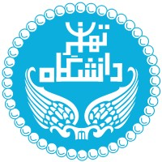
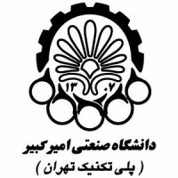

## About Me
I am a research master student in [McGill University](https://www.mcgill.ca/) and [Mila AI Institute](https://mila.quebec/en/), working on Computational Social Science, Network Science, and NLP.

## Education
- McGill University, M.Sc., Computer Science, 2022-Now
- Amirkabir University (Tehran Polytechnic), B.Sc., Computer Science, 2018-2022

## Research
I work on combining graph neural networks and natural language processing to get a better understanding of social networks.

### Research Focus
I started my M.Sc. at McGill and Mila in 2022, working under the supervision of [Reihaneh Rabbany](http://www.reirab.com/). My research focuses on network science, computational social science, and graph representation.  
I enjoy working at the intersection of machine learning and human sciences. By combining these disciplines, I try to uncover valuable insights from real-world data. Currently, my focus lies in the study of social networks, where I aim to identify patterns by bridging between theory and practice.  
[Link to Mila webpage](https://mila.quebec/en/person/sahar-omidi-shayegan/)

## Experience
####  National Research Council Canada - Internship  
&nbsp;&nbsp;&nbsp;&nbsp;&nbsp;&nbsp;&nbsp;&nbsp;&nbsp; **Duration:** May 2023 - August 2023  
&nbsp;&nbsp;&nbsp;&nbsp;&nbsp;&nbsp;&nbsp;&nbsp;&nbsp; **Location:** Ottawa, Ontario, Canada (Remote)  
&nbsp;&nbsp;&nbsp;&nbsp;&nbsp;&nbsp;&nbsp;&nbsp;&nbsp; **Role:** Working on NLP with Isar Nejadgholi

####  University of Tehran - Undergraduate Research Assistant  
&nbsp;&nbsp;&nbsp;&nbsp;&nbsp;&nbsp;&nbsp;&nbsp;&nbsp; **Duration:** Feb 2022 - Sep 2022  
&nbsp;&nbsp;&nbsp;&nbsp;&nbsp;&nbsp;&nbsp;&nbsp;&nbsp; **Location:** Tehran, Iran  
&nbsp;&nbsp;&nbsp;&nbsp;&nbsp;&nbsp;&nbsp;&nbsp;&nbsp; **Role:** Social Media research assistant in the Data Analytics lab under the supervision of Prof. Behnam Bahrak  

####  Amirkabir University of Technology - Undergraduate Research Assistant  
&nbsp;&nbsp;&nbsp;&nbsp;&nbsp;&nbsp;&nbsp;&nbsp;&nbsp; **Duration:** Jan 2022 - Sep 2022  
&nbsp;&nbsp;&nbsp;&nbsp;&nbsp;&nbsp;&nbsp;&nbsp;&nbsp; **Location:** Tehran, Iran  
&nbsp;&nbsp;&nbsp;&nbsp;&nbsp;&nbsp;&nbsp;&nbsp;&nbsp; **Role:** Social Media research assistant in the Data Science lab under the supervision of Prof. Mohammad Akbari  

## Contact
Email: [name][lastname] [at] mila [dot] quebec

[Timeline]({{ site.baseurl }}/timeline/)
